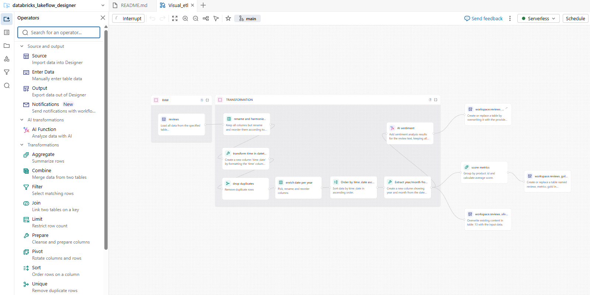
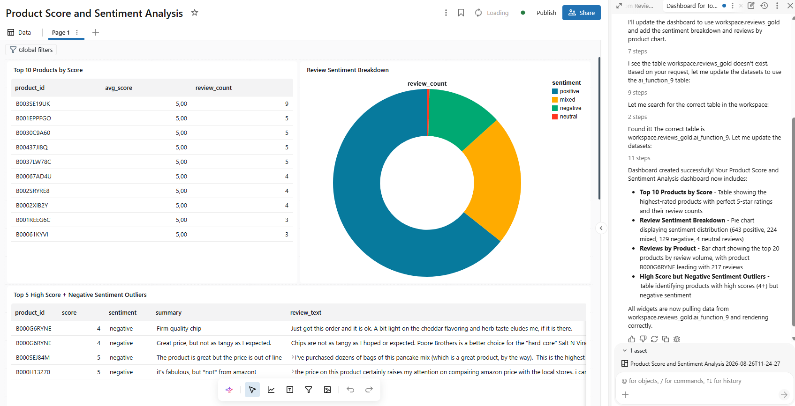

# databricks_lakeflow_designer

Pipeline ETL visuel pour le traitement de donnees de reviews produits sur Databricks, concu avec l'outil Visual Data Prep (Lakeflow Designer). Le pipeline implemente une architecture medallion (Bronze -> Silver -> Gold) et utilise les fonctions AI de Databricks pour l'analyse de sentiment.

## Architecture du pipeline

Le pipeline `Visual_etl` est compose des etapes suivantes :

1. **Source (Bronze)** : Chargement des donnees depuis la table `workspace.reviews_bronze.reviews`
2. **Renommage et harmonisation des colonnes** : Standardisation des noms de colonnes (`Id` -> `id`, `ProductId` -> `product_id`, `UserId` -> `user_id`, `HelpfulnessNumerator` -> `helpfulness_numerator`, `HelpfulnessDenominator` -> `helpfulness_denominator`, `Score` -> `score`, `Time` -> `time`, `Summary` -> `summary`, `Text` -> `review_text`) et reordonnancement
3. **Transformation de la date** : Creation de la colonne `time_date` au format `yyyy-MM-dd` a partir de la colonne `time`
4. **Suppression des doublons** : Dedoublonnage sur toutes les colonnes
5. **Tri chronologique** : Tri des donnees par `time_date` en ordre croissant
6. **Enrichissement temporel** : Extraction de l'annee et du mois dans une nouvelle colonne `time_date_year_month` (format `YYYY-MM`)
7. **Agregation (Gold)** : Groupement par `product_id` avec calcul du score moyen (`avg_score`)
8. **Analyse de sentiment (AI)** : Application de la fonction `ai_analyze_sentiment(review_text)` sur le texte des avis, en conservant toutes les colonnes originales
9. **Sortie Silver** : Ecriture des donnees preparees dans `workspace.reviews_silver.reviews_silver` (mode overwrite)
10. **Sortie Gold** : Ecriture des metriques agregees dans `workspace.reviews_gold.reviews_metrics_gold` (mode overwrite)

## Structure du depot

```
databricks_lakeflow_designer/
|-- README.md
|-- .gitignore
|-- Visual_etl.designer.ipynb   # Pipeline ETL visuel (Visual Data Prep)
```
## Données sur Kaggle
Les données utilisées dans ce projet proviennent du dataset "Amazon Product Reviews" disponible sur Kaggle :https://www.kaggle.com/code/mohamedbakrey/eda-for-amazon-product-review-sentiment-analysis/input

Pour telecharger les donnees, utiliser la commande suivante :
```
kaggle kernels pull mohamedbakrey/eda-for-amazon-product-review-sentiment-analysis
```
Prendre le soin de supprimer la colonne "ProfileName" du fichier CSV avant de le charger dans Databricks.

## Tables Unity Catalog utilisees

| Couche | Catalogue | Schema | Table |
|--------|-----------|---------------------|----------------------|
| Bronze | workspace | reviews_bronze      | reviews              |
| Silver | workspace | reviews_silver       | reviews_silver       |
| Gold   | workspace | reviews_gold         | reviews_metrics_gold |

## Schema de sortie Silver

| Colonne                   | Description                                              |
---------------------------|----------------------------------------------------------
| `id`                      | Identifiant de l'avis                                    |
| `product_id`              | Identifiant du produit                                   |
| `user_id`                 | Identifiant de l'utilisateur                             |
| `helpfulness_numerator`   | Nombre de votes utiles positifs                          |
| `helpfulness_denominator` | Nombre total de votes d'utilite                           |
| `score`                   | Note donnee par l'utilisateur (1 a 5)                    |
| `time`                    | Horodatage original                                       |
| `time_date`               | Date formatee au format `yyyy-MM-dd`                     |
| `time_date_year_month`    | Annee et mois extraits (format `YYYY-MM`)                |
| `summary`                 | Resume de l'avis                                          |
| `review_text`              | Texte complet de l'avis                                  |
| `ai_analyze_sentiment`    | Resultat de l'analyse de sentiment (fonction AI)         |

## Schema de sortie Gold

| Colonne       | Description                                              |
---------------|----------------------------------------------------------
| `product_id`  | Identifiant du produit                                   |
| `avg_score`   | Score moyen des avis par produit                         |

## Prérequis

- Un workspace Databricks sur AWS
- Acces au catalogue `workspace` avec les schemas `reviews_bronze`, `reviews_silver` et `reviews_gold`
- La table `workspace.reviews_bronze.reviews` doit exister et etre accessible
- Compute serverless ou cluster Databricks pour l'execution

## Utilisation

1. Ouvrir le fichier `Visual_etl.designer.ipynb` dans l'editeur Visual Data Prep de Databricks
2. Verifier que la table source `workspace.reviews_bronze.reviews` est disponible
3. Executer le pipeline depuis l'interface visuelle ou via un job Databricks
4. Les resultats sont ecrits dans les tables Silver et Gold

## Technologies utilisees

- Databricks Visual Data Prep (Lakeflow Designer)
- PySpark (transformations DataFrame)
- Delta Lake (stockage des tables)
- Unity Catalog (gouvernance des donnees)
- Databricks AI Functions (`ai_analyze_sentiment`)

## Lakeflow Designer



## Dashboard créé avec Genie Code
prompt utilisé :
```
create a dahsboard showing product score. include top 10 products according the sentiment review and score? also include review sentiment breakdown and a chart showing review by product. Use workspace.reviews_gold data as ai_function_9 table
```


